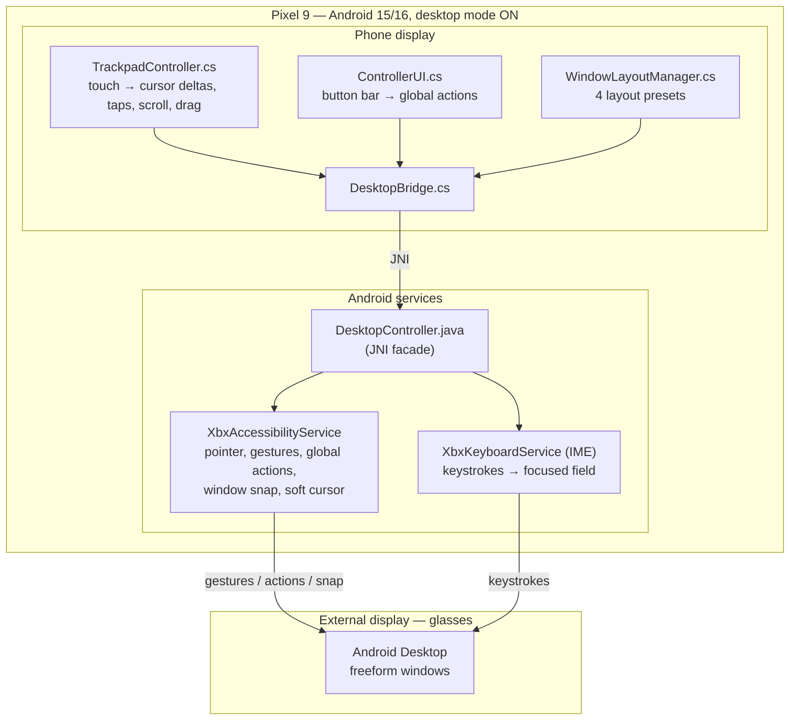
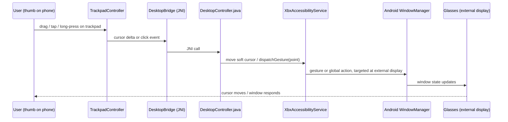
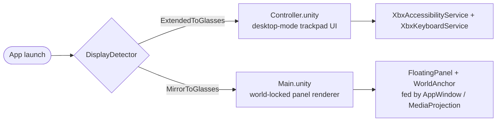

# XBXA01 AR App

Unity Android app that drives **XREAL xbx a01** AR glasses from a **Google Pixel 9**
over USB-C DisplayPort Alt Mode.

**Status:** Desktop-mode controller — MVP scaffolding complete, on-device gesture
verification pending (see [Current status](#current-status) below).

---

## What this is (today)

The glasses are a passive USB-C display with a 3DoF IMU — no camera, no onboard
compute, no XREAL SDK support. Two designs have been built against that hardware:

1. **Desktop-mode controller** (current, primary) — the Pixel 9 drives the glasses as
   an **extended display in Android desktop mode**, so Android itself renders real,
   resizable, freeform app windows. The Unity app renders nothing on the glasses; it
   turns the **phone into a trackpad + button bar + soft keyboard** that controls the
   desktop via an AccessibilityService (pointer/gestures/global actions) and an IME
   (keyboard). Full design: **[`DESKTOP_MODE.md`](DESKTOP_MODE.md)**.
2. **World-locked panel renderer** (fallback) — for devices/OS versions where desktop
   mode isn't available, the glasses run in **mirror mode** and Unity renders its own
   world-locked Main + PiP panels directly, fed by an app-in-a-window
   (`VirtualDisplay` + `ImageReader`) or a whole-screen `MediaProjection` capture. Full
   spec: **[`SPEC.md`](SPEC.md)**.

Nothing from the renderer was deleted when the controller became primary —
`DisplayDetector` picks the path at runtime (`ExtendedToGlasses` → controller scene,
`MirrorToGlasses` → legacy panel scene).

### Why the pivot

The renderer's touch controls were blind finger gestures on a mirrored phone screen
(nothing to look at, nothing discoverable), and a sideloaded app can't launch other
apps onto its own `VirtualDisplay` (Android denies it — `SecurityException`), so real
apps could only reach the panels via a tethered `adb` call. Desktop mode removes both
problems by letting Android own window management and app launching; the app's job
shrinks to input only. See `DESKTOP_MODE.md` §0 for the full writeup.

---

## Architecture (controller, current)



Both Android services are ordinary components an end user enables once in Settings —
no root, no system signing required for the MVP. Full detail, including the honest
limits on cross-display gesture dispatch, is in `DESKTOP_MODE.md` §2–3.

### Input path, end to end



The step `A11Y → WM` targeted at the *external* display is the one open risk in this
chain — see caveat C2 below and `DESKTOP_MODE.md` §3.

### Runtime mode selection



---

## Hardware

| | |
|---|---|
| **Glasses** | XREAL xbx a01 (Model ID: XBXA01) — 1920×1080/eye, 120Hz, 50° FOV, 3DoF IMU, no camera, USB-C DP Alt Mode, bus-powered |
| **Host** | Google Pixel 9 — Tensor G4, Android 15+, USB 3.2 Gen 2 DP Alt Mode |
| **Display mode** | Mirror by default; **desktop mode** (extended) required for the controller — enabled via `tools/enable_desktop_mode.sh` |
| **XREAL SDK** | Not supported on this device (not in the compatibility matrix) — all input/display access goes through plain Android APIs |
| **Sensors** | IMU only (1,000Hz) — no camera, no depth, no hand tracking |

---

## Repo layout

```
Assets/
├── Scenes/
│   ├── Controller.unity        ← default scene (desktop-mode controller)
│   └── Main.unity              ← legacy world-locked panel scene (mirror fallback)
├── Scripts/
│   ├── Core/AppController.cs
│   ├── Desktop/                ← ControllerUI, DesktopBridge, WindowLayoutManager
│   ├── Input/                  ← TrackpadController (controller), PhoneController (legacy)
│   ├── Display/DisplayDetector.cs
│   ├── IMU/                    ← HeadTracker, IMUListener
│   ├── Panels/                 ← FloatingPanel, WorldAnchor, PanelManager (legacy renderer)
│   ├── AppWindow/               ← AppWindow.cs, MediaProjectionWindow.cs (legacy content sources)
│   └── Debug/DebugOverlay.cs
├── Plugins/Android/            ← XbxAccessibilityService, XbxKeyboardService, DesktopController
│                                  (+ legacy VirtualAppWindow / MediaProjection Java bridges)
└── Editor/                     ← SceneBuilder.cs, ControllerSceneBuilder.cs, BuildScript.cs
tools/
├── deploy.bat                  ← headless build + install + launch
├── setup_adb.bat                ← locate/add adb.exe to PATH
├── enable_desktop_mode.sh      ← one-time adb setup for desktop mode
└── launch_on_panel.sh          ← tethered app launch onto the legacy panel (mirror mode)
```

Scenes are **generated, not hand-authored** — `SceneBuilder` / `ControllerSceneBuilder`
build them from code so a fresh clone builds with no manual Editor work.

---

## Build & run

```bat
:: one-time
tools\setup_adb.bat
tools\enable_desktop_mode.sh      :: run under Git Bash / WSL; reboot the phone when it says to

:: build, install, launch (Pixel 9 plugged in)
tools\deploy.bat debug
```

`deploy.bat` builds the APK via Unity batchmode (`BuildScript`), `adb install`s it, and
launches it. Requires Unity 2022.3 LTS or Unity 6, Android Build Support, and
`adb` on PATH — see `SPEC.md` §4 for full one-time setup.

---

## Docs map

| Doc | Covers |
|---|---|
| [`DESKTOP_MODE.md`](DESKTOP_MODE.md) | Current design: controller architecture, input path & its limits, layout presets, keyboard, files, open verification items |
| [`SPEC.md`](SPEC.md) | Original renderer spec: user journey, acceptance criteria, world-lock math, panel content sources, build/deploy/test steps — now the mirror-mode fallback |

---

## Current status

Scaffolding for the controller (trackpad input, button bar, layout presets, the a11y +
IME services, JNI bridge) is committed and builds. Not yet verified on-device:

1. **Cross-display gesture dispatch** — can `XbxAccessibilityService.dispatchGesture`
   reach the *external* (glasses) desktop display from a service bound on the *phone*
   display? This is the single biggest open risk (`DESKTOP_MODE.md` §3, caveat C2).
2. Whether `force_desktop_mode_on_external_displays` actually produces freeform windows
   on this Pixel 9 build, versus just a scaled desktop.
3. Soft-cursor overlay latency at 1920×1080/120Hz.
4. IME enable/select UX — whether the user can be deep-linked to it or must navigate
   Settings manually each session.

If C1/C2 don't fully land, the design already has fallbacks: a paired BT mouse +
keyboard (desktop mode accepts these natively), tethered `adb` control, or a
system-signed build with `INJECT_EVENTS` (out of scope for a sideloaded app).

---

## Resources

| Resource | URL |
|---|---|
| XREAL xbxa01 product page | https://www.xreal.com/xbxa01 |
| xbxa01 specs & manual | https://tutorials.xreal.com/docs/glasses/xbxa01/ |
| XREAL SDK device compatibility | https://docs.xreal.com/XREALDevices/Compatibility |
| Android DisplayManager API | https://developer.android.com/reference/android/hardware/display/DisplayManager |
| Android AccessibilityService API | https://developer.android.com/reference/android/accessibilityservice/AccessibilityService |
| Android InputMethodService API | https://developer.android.com/reference/android/inputmethodservice/InputMethodService |
| Pixel 9 specs | https://store.google.com/product/pixel_9_specs |
| GitHub repo | https://github.com/adourish/xbxa01 |
